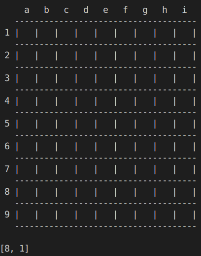
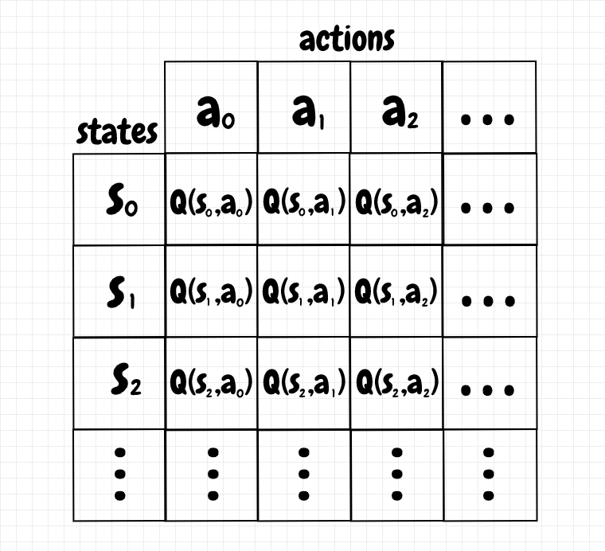
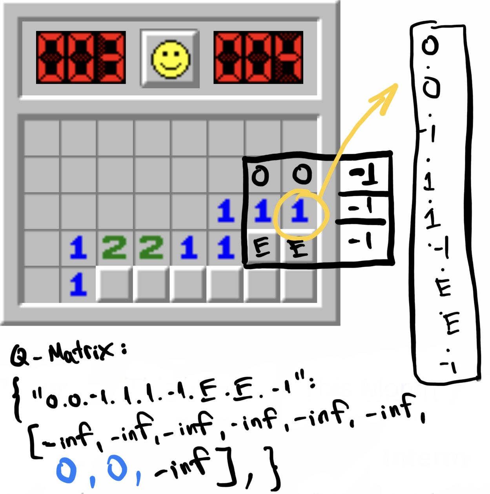
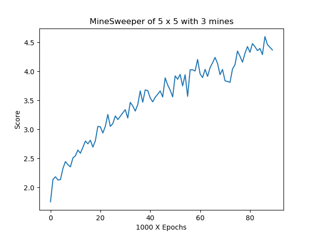
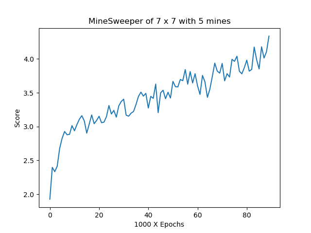

# AI_MineSweeper
The agent is trained by using the reinforcement learning method (Q-Matrix). 
Failed Attempt          |  Successful Attempt
:-------------------------:|:-------------------------:
  |  
# Reinforcement Learning
The reinforcement learning is simply a table of states and actions, where its value is the reward for a specific state with associating action. Below is the example of a Q-matrix used in the reinforcement learning method. 

## Defining State

In the minesweeper, we do not need to care about the squares where all of their neighbors are already revealed. We only care about the quares that has at least one of its neighbors being empty. Therefore, we decided to define a state as a square that has at least one of its neighbors being empty. For the action of revealing a square, which is already reaveled or out of the grid, from its neighbors of a state, its reward is defined as `-inf`. Otherwise, the initial reward is `0`. 
\
\
For the given example below, the state of the square in the green cirle is `0.0.-1.1.1.1.-1.E.E.-1`. 9 actions of that state for revealing 9 squares which are its neighbors and itself are initially `[-inf, -inf, -inf, -inf, -inf, -inf, 0, 0, -inf]`

## Algorithm
We initialize the agent with learning rate is 0.1, . For an epoch, we will repeat following steps until the game ends:

1. Finding all possible states for the current grid and then
2. Save all of them to the Q-Matrix if they are not in the Q-Matrix and save all of them to the **currentStates** array.
3. Traverse all possible states in the **currentStates** array to see which state has the action having the most value in Q-Matrix. Return that state.
4. Using -greedy choose an action for that state.
5. Performing that action to get the next state and reward (0: not trigger a mine, -1: trigger a mine)
6. Update the current state in Q-Matrix as: \
`Q(s,a) = Q(s,a) + learning_rate*(reward+` `*argmax(Q(s',a')) - Q(s,a))`

# Advantage
With this way of defining state, the agents which are trained in small sizes of grid and small numbers of mines can play games with larger sizes of grid and larger numbers of mines.

# Training
We first start with  = 0.1 and increasing it by  = 0.01 for every 1000 epochs. We will run 90,000 epochs until  = 1. 

## Models
We trained 2 models: one playing on a 5x5 board with 3 mines and one playing on a 7x7 board with 5 mines, each of them were trained for 90,000 epochs. After each epoch of training, we calculated the score for this epoch:
1. add 1 pt for each iteration having an action that does not trigger a mine
2. add 3 pts for each iteration (the last iteration) having an action that wins the game
3. add 0 pt for the iteration that loses the game. (and the epoch will end)
We took the average score of every 1000 epochs. The resuls are shown below.

5x5 grid with 3 mines           |  7x7 grid with 5 mines
:-------------------------:|:-------------------------:
  |  

# Testing
For the model `7x7_5`, it only wins 2/1000 random games of the 9x9 grid and 10 mines. However, supprisely, the model `5x5_3` wins 16/1000. 
\
\
Our thinking is because the `7x7_5` needs to cover more cases than `5x5_3` but it is trained in the same number of epochs with `5x5_3`, it does not cover enough cases. 
\
\
However, we need to explore more. 
